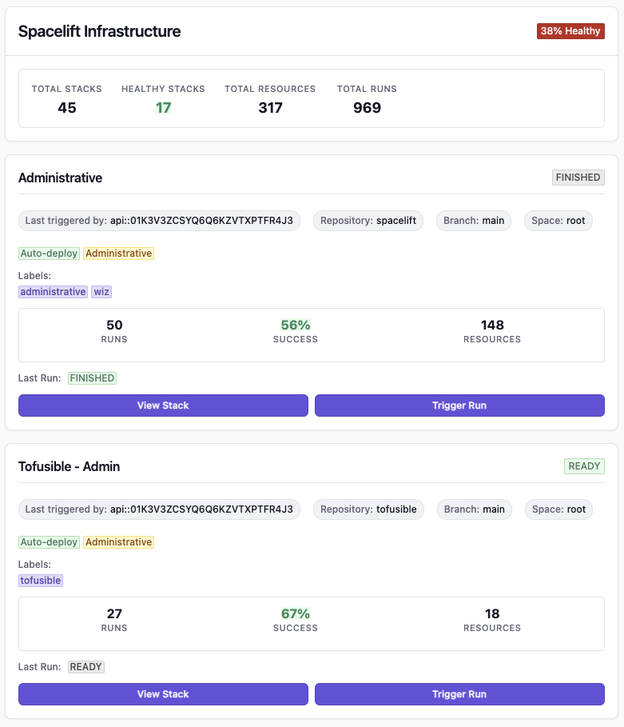

# Spacelift Plugin for Cortex

A comprehensive Cortex plugin that integrates with Spacelift to provide infrastructure deployment insights directly within your Cortex service catalog.



## Features

- **Multi-Stack Dashboard**: Automatically discovers and displays all accessible Spacelift stacks
- **Infrastructure Overview**: Summary metrics showing total stacks, health percentage, resources, and runs
- **Stack Details**: Individual stack cards showing provider, repository, metrics, and status
- **Direct Actions**: Trigger deployments directly from Cortex for any stack
- **Real-time Status**: Live data from Spacelift showing current deployment states

## Stack Information

Each stack displays:
- **Status Badge**: Current stack state (Ready, Preparing, etc.)
- **Repository Info**: Source repository and provider (Terraform, Pulumi, etc.)
- **Metrics**: Run count, success rate, and resource count
- **Last Run Status**: Most recent deployment result
- **Quick Actions**: View in Spacelift and trigger new runs

## Configuration

### Plugin Configuration

Configure the plugin with the following settings:

```json
{
  "spaceliftEndpoint": "https://your-account.app.spacelift.io",
  "apiKeyId": "your-api-key-id",
  "apiKeySecret": "your-api-key-secret"
}
```

### Configuration Options

- `spaceliftEndpoint` (required): Your Spacelift account URL
- `apiKeyId` (required): Spacelift API key ID
- `apiKeySecret` (required): Spacelift API key secret

The plugin automatically discovers and displays all stacks accessible with the provided API credentials.

### Entity Configuration

The plugin displays all accessible stacks in your Spacelift account. No entity-specific configuration is required - simply add the plugin to any service page or dashboard to see your infrastructure overview.

## Development

### Prerequisites

- Node.js 18+
- npm or yarn
- Spacelift account with API access

### Setup

1. Clone the repository:
```bash
git clone <repository-url>
cd cortex-spacelift-plugin
```

2. Install dependencies:
```bash
npm install
```

3. Create environment variables file:
Create a `.env` file in the root directory with your Spacelift credentials:
```env
SPACELIFT_ENDPOINT=https://your-account.app.spacelift.io
SPACELIFT_API_KEY_ID=your-api-key-id-here
SPACELIFT_API_KEY_SECRET=your-api-key-secret-here
```

4. Start the development server:
```bash
npm run dev
```

The plugin will be available at `http://localhost:3000`

### Development Architecture

The plugin uses a dual-mode architecture for optimal development and production:

- **Development Mode** (localhost): Direct GraphQL API calls to Spacelift via webpack proxy
- **Production Mode** (Cortex): Uses Cortex backend proxy for API calls

#### Key Files Structure

```
src/
├── components/
│   ├── SpaceliftPlugin.tsx      # Main React component
│   └── SpaceliftPlugin.css      # Component styles
├── services/
│   ├── spaceliftService.ts      # Environment-aware service layer
│   ├── spaceliftApi.ts          # Direct Spacelift GraphQL API calls
│   └── spaceliftLocalService.ts # Webpack proxy wrapper for dev
├── types/
│   └── spacelift.ts             # TypeScript type definitions
└── index.tsx                    # Entry point
```

#### Performance Optimizations

The plugin includes several performance optimizations:

- **Single optimized GraphQL query** instead of N+1 queries (reduced from 46 to 1 request)
- **Client-side metrics calculation** from fetched run data
- **Webpack proxy configuration** for CORS-free local development
- **Hot module replacement** for fast development iteration

### CORS Handling

Local development uses webpack dev server proxy to handle CORS issues:
- All `/spacelift-api/*` requests are proxied to your Spacelift endpoint
- No need for browser CORS extensions or modifications

**Important**: The development server requires real Spacelift API credentials. Mock data has been removed to ensure accurate integration testing.

#### Getting Spacelift API Credentials

1. Log into your Spacelift account
2. Go to Settings → API Keys
3. Create a new API key with the following permissions:
   - Read access to stacks
   - Read access to runs
   - (Optional) Write access to trigger runs
4. Copy the API key ID and secret to your `.env` file

### Building

Build the plugin for production:
```bash
npm run build
```

The built files will be in the `dist/` directory.

### Testing

Run the test suite:
```bash
npm test
```

Run linting:
```bash
npm run lint
```

Run type checking:
```bash
npm run typecheck
```

## Installation in Cortex

1. Build the plugin using `npm run build`
2. Upload the `dist/index.html` file to Cortex
3. Configure the plugin with your Spacelift API credentials
4. Add the plugin to your service pages or dashboard

## API Integration

The plugin uses Spacelift's GraphQL API to fetch:
- Stack information and configuration
- Run history and status
- Resource counts and changes
- Drift detection status

### Required Permissions

Your Spacelift API key needs the following permissions:
- Read access to stacks
- Read access to runs
- (Optional) Write access to trigger runs

## Troubleshooting

### Common Development Issues

1. **Authentication Errors**: 
   - Verify your API key ID and secret are correct in `.env`
   - Ensure the API key has read permissions for stacks and runs
   - Check if the API key is expired or revoked

2. **CORS Issues in Development**:
   - Ensure your `SPACELIFT_ENDPOINT` in `.env` matches your Spacelift URL exactly
   - The webpack dev server proxy should handle CORS automatically
   - Check browser console for proxy errors

3. **GraphQL Errors**:
   - "Cannot query field X": Usually means the field doesn't exist in the GraphQL schema
   - Check the Spacelift GraphQL documentation for correct field names
   - Verify your API permissions allow access to the requested data

4. **Plugin Shows "0% Healthy"**:
   - Check if stacks have any recent runs
   - Verify the health calculation logic matches your expected criteria
   - Look for console errors during data fetching

5. **Slow Loading (15-30+ seconds)**:
   - This was fixed with query optimization - should now load in 2-5 seconds
   - If still slow, check network tab for multiple identical requests

6. **Trigger Run Fails**:
   - Ensure your API key has write permissions
   - Check if the stack allows manual triggering
   - Verify the GraphQL mutation is correct (`runTrigger` not `runCreate`)

### Development Debug Mode

- Open browser DevTools Console to see detailed error messages
- Check Network tab to see GraphQL requests and responses
- Enable verbose logging by adding `console.log` statements in services

### Production Issues

1. **Stack Not Found**: Ensure the stack ID exists and your API key has access
2. **CORS Issues**: The plugin uses Cortex's proxy system to avoid CORS restrictions
3. **Slow Performance**: Ensure you're using the optimized GraphQL queries

### Debug Mode

Enable debug mode in Cortex plugin settings to see detailed error messages and API responses.

## Contributing

1. Fork the repository
2. Create a feature branch
3. Write tests for new functionality
4. Run the test suite and linting
5. Submit a pull request

## License

MIT License - see LICENSE file for details