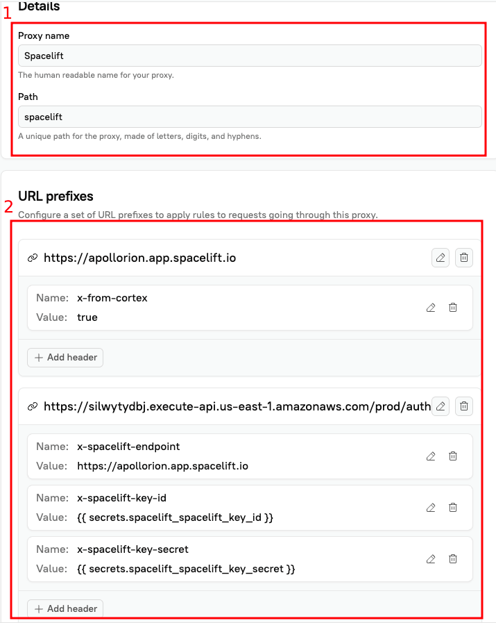

# Spacelift Cortex Plugin Terraform Configuration

This Terraform configuration deploys the Spacelift plugin to Cortex using the REST API provider.

## Prerequisites

- Terraform or OpenTofu installed
- Node.js and npm installed
- Cortex API token with 'Edit plugins' permission
- Spacelift API credentials (key ID and secret)
- AWS Access

This module *will* create an API gateway and lambda function in your AWS account.
This function *must* be publicly accessible.
The function of the lambda is to generate a JWT token for Spacelift API authentication.

## Usage

First, you *must* create a Cortex proxy manually to use this plugin. Cortex does not have a public API to create
proxies, so this step cannot be automated via Terraform.

1. In cortex, navigate to `Plugins` -> `Create Proxy` at the top right of the Plugins screen.
2. Only create a basic proxy pointed to google intially. We will modify it later.

- Give it a `name`, e.g. `Spacelift Proxy`
- Give it a `path`, e.g. `spacelift` (this will be used as the `proxy_path` in the terraform module later)
- *!Important*: It must have initial URL prefixes to create the proxy. Recommend just temporarily adding
  `https://google.com` as a placeholder. We will delete it later.

3. Cick `Create Proxy` (the first red box in the screenshot below should be the only thing you've filled out)
4. Update the `proxy_path` variable in your tf code (example below) to match the path you set in step 2.
5. Apply the tf code to create the plugin.
  - ```terraform
     module "cortex_spacelift_plugin" {
       source = "github.com/spacelift-io/cortex-plugin?ref=v1.0.0"

       cortex_api_token     = "{your_cortex_api_token}"
       spacelift_endpoint   = "https://{youraccount}.app.spacelift.io"
       spacelift_key_id     = "{your_spacelift_key_id}"
       spacelift_key_secret = "{your_spacelift_key_secret}"
       proxy_path           = "{your_proxy_path}"

       aws_region            = "us-east-1"
       plugin_tag            = "spacelift"
       plugin_name           = "spacelift"
       plugin_description    = "Spacelift plugin for Cortex"
       minimum_role_required = "VIEWER"
     }

     output "proxy_configuration" {
       value = module.cortex_spacelift_plugin.proxy_configuration
     }
     ```
6. The TF will output something like the following, update your proxy (2nd red box in the screenshot below) to have the
   following URL prefixes:

- Note: Do *not* copy the below example, yours will be slightly different from the example.
  - ```terraform
        {
           "https://h3kmnjudj4.execute-api.us-east-1.amazonaws.com/prod/auth" = {
             urlHeaders = [
               {
                 name  = "x-spacelift-endpoint"
                 value = "https://apollorion.app.spacelift.io"
               },
               {
                 name  = "x-spacelift-key-id"
                 value = "{{ secrets.spacelift_key_id }}"
               },
               {
                 name  = "x-spacelift-key-secret"
                 value = "{{ secrets.spacelift_key_secret }}"
               }
             ]
           },
           "https://apollorion.app.spacelift.io" = {
             urlHeaders = [
               {
                 name  = "x-from-cortex"
                 value = "true"
               }
             ]
           }
        }
        ```

7. Delete the initial URL prefix you created in step 2 (e.g. `https://google.com`)

### Example Proxy Setup

This is what your proxy should, roughly, look like after you've created it in the UI.


